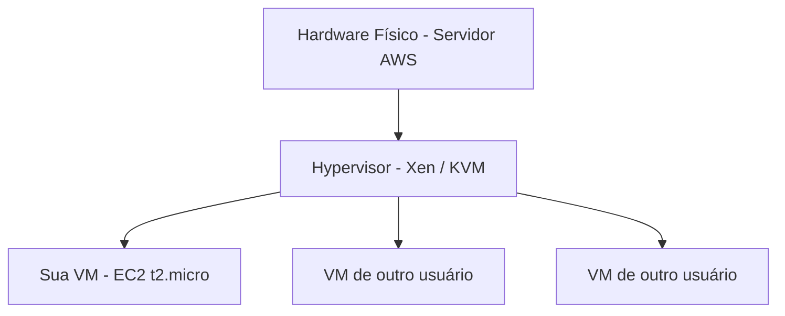
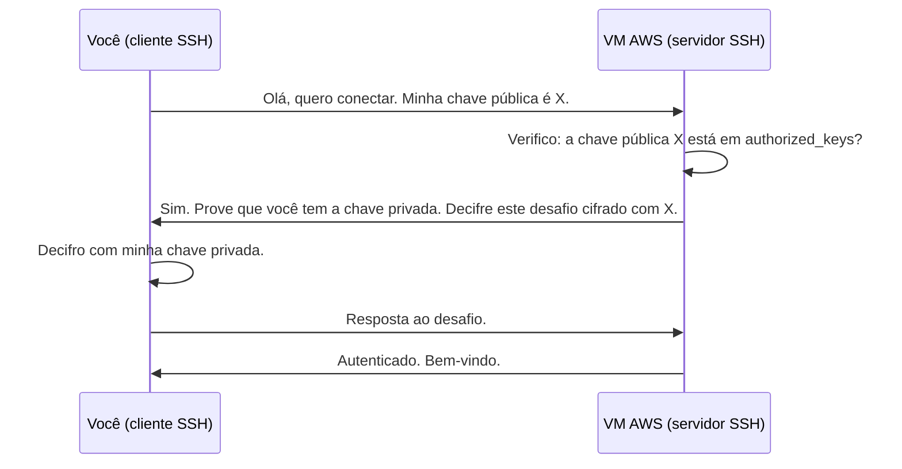
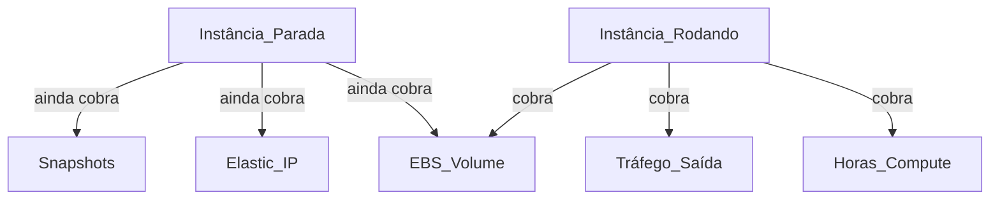

# Aula 3a — Criando uma VM na AWS

> *"Soluções temporárias geralmente levam a problemas permanentes."* — Craig S. Bruce

---

## Contexto Histórico

A computação em nuvem não surgiu do nada. O caminho foi longo:

- **1960s** — John McCarthy propõe a ideia de *utility computing*: computação como serviço público, como eletricidade. A ideia era herética na época.
- **1999** — Salesforce lança o primeiro SaaS moderno, entregando software via navegador.
- **2002** — Amazon lança os Amazon Web Services originais, ainda apenas um conjunto de APIs internas.
- **2006** — AWS lança EC2 (Elastic Compute Cloud) e S3. É o marco fundador da nuvem pública moderna. A data é importante: EC2 precede o iPhone.
- **2010s** — Google, Microsoft (Azure) e outros entram no mercado. A nuvem deixa de ser experimento e vira infraestrutura crítica global.
- **Hoje** — AWS lidera com ~31% do mercado global de cloud, seguida por Azure (~25%) e Google Cloud (~11%). A AWS gerou **US$ 91 bilhões em receita em 2023**.

O EC2 que você usa nesta aula é o mesmo serviço que roda Netflix, Airbnb e boa parte da internet.

---

## O Que é uma VM?

Uma Máquina Virtual (VM) é um computador simulado dentro de outro computador. O hardware físico é partilhado entre várias VMs por meio de um **hypervisor**.



O modelo de negócio da AWS aqui é simples: **ela compra servidores em escala massiva, divide em pedaços menores e aluga esses pedaços**. Você paga por hora de uso. Economias de escala viabilizam preços que você jamais conseguiria comprando hardware próprio.

---

## Anatomia do EC2

| Componente | O que é | Analogia |
|---|---|---|
| **AMI** (Amazon Machine Image) | Template do sistema operacional | O "molde" do HD |
| **Instance Type** | Quantidade de CPU e RAM | O "tamanho" da máquina |
| **Key Pair** | Par de chaves RSA para SSH | Cadeado (pública) + chave (privada) |
| **Security Group** | Firewall gerenciado | Porteiro que decide quem entra |
| **EBS Volume** | Disco virtual persistente | HD externo |
| **Elastic IP** | IP fixo opcional | Endereço fixo versus DHCP |

---

## Passo a Passo: Criando e Acessando sua VM

```mermaid
flowchart LR
    A[Criar conta AWS] --> B[Acessar EC2 no console]
    B --> C[Executar instância]
    C --> D[Escolher AMI - Ubuntu 24.04 LTS]
    D --> E[Escolher t2.micro - Free Tier]
    E --> F[Gerar par de chaves RSA - .pem]
    F --> G[Baixar chave privada]
    G --> H[Iniciar instância]
    H --> I[Verificar status - Running]
    I --> J[chmod 600 chave.pem]
    J --> K[ssh -i chave.pem ubuntu@IP]
    K --> L[Você está na nuvem!]
```



### Comandos essenciais após conectar

```bash
# Proteger a chave privada (obrigatório antes do SSH)
chmod 600 ~/.ssh/sua_chave.pem

# Conectar via SSH
ssh -i "~/.ssh/sua_chave.pem" ubuntu@<IP_PUBLICO_DA_INSTANCIA>

# Transferir arquivo local → VM
scp -i "~/.ssh/sua_chave.pem" arquivo.csv ubuntu@<IP>:~

# Transferir arquivo VM → local
scp -i "~/.ssh/sua_chave.pem" ubuntu@<IP>:~/resultado.csv ./local/
```

---

## Criptografia por Trás do SSH

O par de chaves RSA não é mágica. É matemática:



A **chave privada** nunca sai da sua máquina. A AWS só armazena a chave pública. Por isso `chmod 600` importa: se sua chave privada for legível por outros usuários do sistema, o SSH recusa a conexão por segurança.

---

## Mnemônico: NAMI

Para não esquecer os passos críticos de gerenciamento da instância:

> **N**unca deixar rodando sem necessidade  
> **A**pagar a instância quando não precisar mais  
> **M**onitorar o painel para verificar o estado  
> **I**nterromper antes de fechar o navegador  

---

## Curiosidades

- **t2.micro** — O "t" significa *burstable*: a VM recebe créditos de CPU em períodos ociosos e os gasta quando precisa de processamento intenso. É propositalmente fraco para forçar você a pagar mais quando precisar de mais.
- **Free Tier** — AWS oferece 750 horas/mês de t2.micro por 12 meses para contas novas. 750 horas = 31,25 dias. Ou seja, **uma instância rodando 24/7 por 30 dias** ainda está no free tier. Duas instâncias simultâneas já excedem.
- **Região** — A latência importa. Um servidor em us-east-1 (Virgínia) está a ~140ms de São Paulo. A região sa-east-1 (São Paulo) existe e costuma ter latência abaixo de 5ms para conexões locais, mas pode ser mais cara.
- **Ubuntu vs Amazon Linux** — O professor recomenda Ubuntu ou Debian. Amazon Linux é baseado em RHEL e tem particularidades que podem confundir quem vem de Debian/Ubuntu. Para fins acadêmicos, Ubuntu é a escolha mais documentada.

---

## Considerações Críticas sobre a AWS

Esta é a parte que os tutoriais oficiais omitem.

### O Modelo de Negócio é Projetado para Confundir

A AWS tem mais de **200 serviços** e uma estrutura de preços deliberadamente complexa. Cobranças vêm de múltiplas dimensões simultâneas:

- Horas de compute (EC2)
- Armazenamento (EBS, mesmo com a instância desligada)
- Tráfego de rede de saída (*egress*)
- IPs elásticos não utilizados
- Snapshots esquecidos

Há relatos recorrentes de desenvolvedores que acumularam centenas de dólares em cobranças inesperadas por esquecerem recursos ativos. O Free Tier não cobre tudo e tem limites pouco visíveis no console.



**Regra prática:** se você não vai usar, **encerre (terminate)** a instância. Apenas interromper (stop) não elimina cobranças de armazenamento.

### Lock-in

Ao construir arquitetura sobre serviços proprietários da AWS (RDS, Lambda, DynamoDB, etc.), você cria **dependência tecnológica** que dificulta migração posterior. O EC2 puro, por usar Linux padrão, é o menos problemático nesse sentido — você pode mover uma VM para qualquer outro provedor.

### Privacidade e Soberania de Dados

Dados armazenados na AWS estão sujeitos ao **Cloud Act americano** (2018): autoridades dos EUA podem solicitar acesso a dados em servidores AWS mesmo fora dos EUA, mediante ordem judicial americana. Para dados sensíveis de instituições públicas brasileiras, isso pode ser uma questão legal relevante.

### Alternativas a Considerar

| Provedor | Vantagem | Contexto de uso |
|---|---|---|
| **AWS** | Maior ecossistema, mais documentação | Padrão de mercado |
| **Google Cloud** | Melhor para ML/AI (TPUs) | Projetos de machine learning |
| **Azure** | Integração com Microsoft | Ambientes corporativos com Windows |
| **DigitalOcean / Linode** | Simplicidade e preço previsível | Projetos pessoais e startups |
| **Servidores UFPR** | Gratuito, dados no Brasil | Projetos acadêmicos — use o que você já tem |

Para os projetos do DSBD, os servidores `cpu1`, `cpu2` e `orval` já disponíveis em `ssh.inf.ufpr.br` são funcionalmente equivalentes ao EC2 para os fins do curso — sem custo e sem risco de cobrança inesperada.

---

## Resumo em Uma Linha

> Uma VM EC2 é Linux rodando em hardware alugado por hora. SSH é o protocolo de acesso. RSA é o mecanismo de autenticação. Nunca esqueça de encerrar o que não usa.

---

