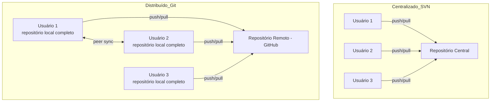
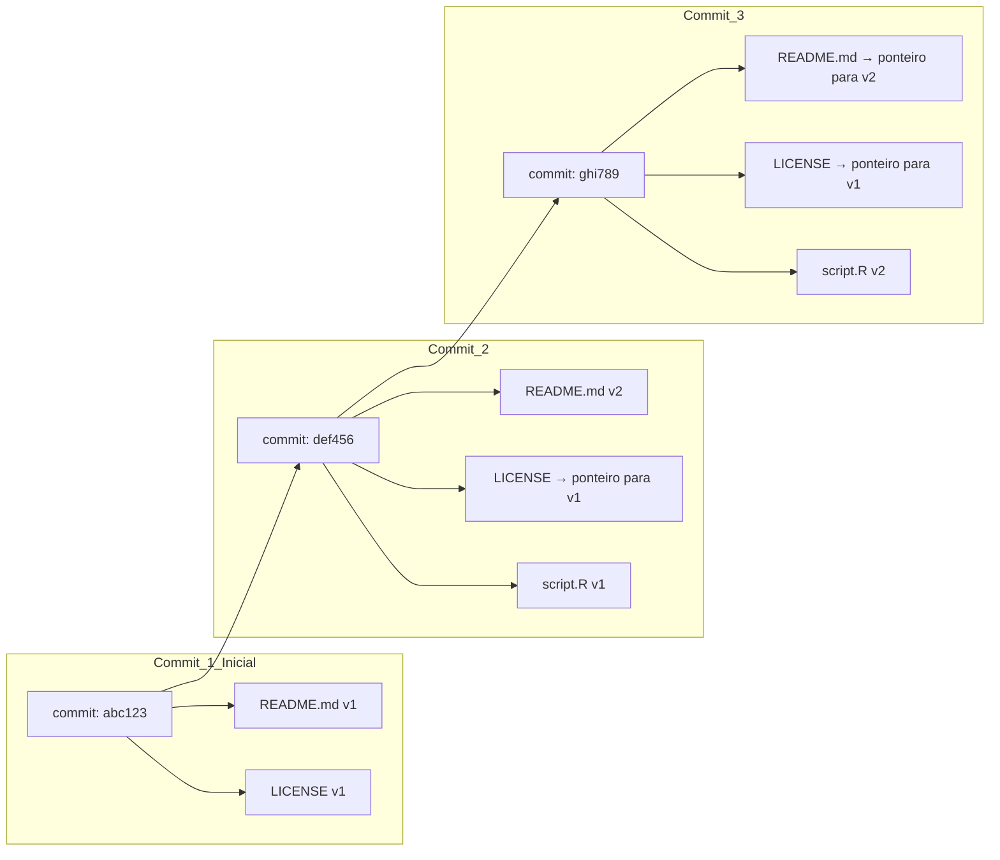
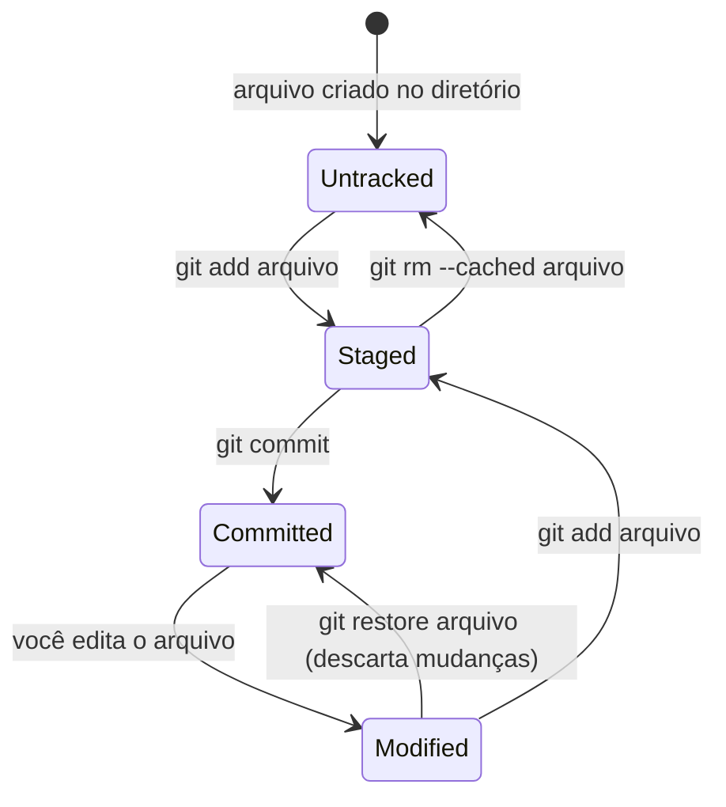
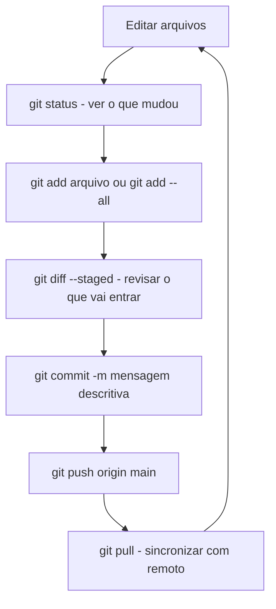
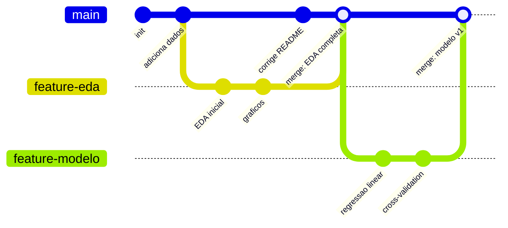
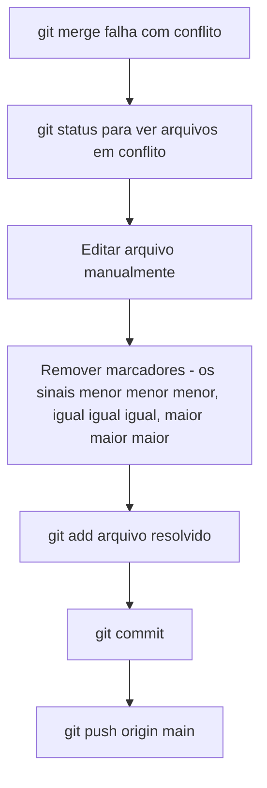
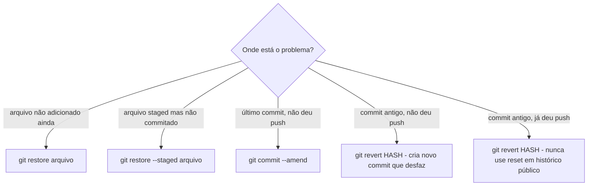
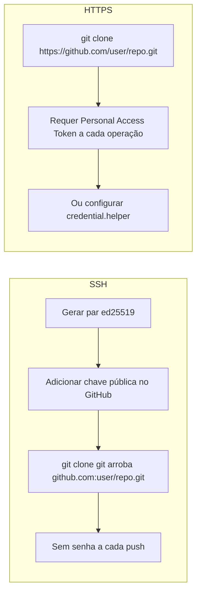
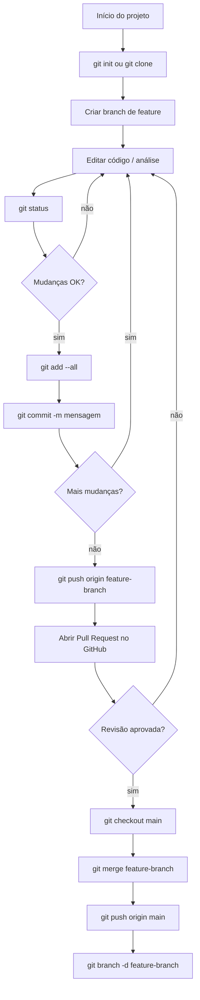

# Aula 3b — Controle de Versão com Git

> *"Para quem só sabe usar martelo, todo problema é um prego."* — Abraham Maslow

---

## Contexto Histórico

O controle de versão tem uma história mais antiga do que parece:

- **1972** — SCCS (Source Code Control System), primeiro sistema de versionamento formal. Rodava em UNIX, armazenava apenas *diffs* (diferenças entre versões).
- **1986** — CVS (Concurrent Versions System) surge como resposta à necessidade de colaboração. Primeiro sistema amplamente adotado.
- **2000** — Subversion (SVN) é criado para corrigir as limitações do CVS. Centralizado, mas com melhor tratamento de diretórios e operações atômicas.
- **2005** — **Linus Torvalds cria o Git em 10 dias.** O gatilho foi o fim da licença gratuita do BitKeeper, sistema que o kernel Linux usava. Torvalds queria algo distribuído, rápido e robusto o suficiente para 1.000 colaboradores. Conseguiu as três coisas.
- **2008** — GitHub é fundado por Tom Preston-Werner, Chris Wanstrath e PJ Hyett. Transforma o Git de ferramenta de linha de comando em plataforma social de código.
- **2018** — Microsoft adquire o GitHub por **US$ 7,5 bilhões**. A comunidade open-source reage com desconfiança; muitos migram para GitLab. Na prática, o GitHub continuou independente.

Hoje o Git controla virtualmente todo o software profissional do mundo. Não saber Git em 2025 é equivalente a não saber usar e-mail em 2005.

---

## Por Que Controle de Versão Existe

O problema sem versionamento:

```
projeto_v0.1.zip
projeto_v0.2.zip
projeto_v1.0.zip
projeto_final.zip
projeto_finalMesmo.zip
projeto_finalAgoraVai.zip
projeto_final_depois_de_correcoes.zip
projeto_FINAL2.zip
projeto_1.0_para_submissao.zip
projeto_anterior_estava_errado.zip
projeto_finalFinal2.0.zip
```

Isso não é exagero. É o estado real de projetos sem versionamento formal. O controle de versão resolve quatro problemas fundamentais:

1. **Histórico** — o que mudou, quando e por quem
2. **Reversibilidade** — voltar para qualquer ponto anterior
3. **Colaboração** — múltiplas pessoas no mesmo projeto sem destruição mútua
4. **Ramificação** — experimentar ideias sem arriscar o projeto principal

---

## Centralizado vs Distribuído



| Característica | Centralizado (SVN) | Distribuído (Git) |
|---|---|---|
| Ponto único de falha | Sim | Não |
| Trabalho offline | Não | Sim |
| Histórico completo local | Não | Sim |
| Velocidade de operações | Depende da rede | Local = instantâneo |
| Complexidade | Menor | Maior |
| Adoção atual | Legado | Padrão |

---

## Como o Git Armazena Dados

Git não armazena *diferenças* (como CVS/SVN). Armazena **snapshots** do estado completo dos arquivos. Arquivos não modificados são representados por ponteiros para a versão anterior — sem duplicação.



Isso significa que cada commit é identificado por um **hash SHA-1** (40 caracteres hexadecimais) calculado sobre o conteúdo. Se um único byte mudar, o hash muda completamente. **É impossível alterar silenciosamente o histórico** sem que o Git detecte.

---

## O Ciclo de Vida de um Arquivo no Git



Os três estados que todo arquivo pode ter:

- **Untracked** — Git sabe que existe, mas não rastreia
- **Staged** — Git vai incluir no próximo commit
- **Committed** — salvo permanentemente no histórico local

---

## Configuração e Primeiros Passos

```bash
# Configuração inicial (uma vez por máquina)
git config --global user.name "Seu Nome"
git config --global user.email "email@exemplo.com"
git config --global core.editor vim   # ou nano, ou code

# Verificar configuração
git config --list --show-origin

# Clonar repositório existente
git clone git@github.com:USUARIO/PROJETO.git

# Iniciar repositório local do zero
git init meu-projeto
cd meu-projeto
```

---

## O Fluxo Diário de Trabalho



```bash
# Ver estado atual
git status
git diff                        # mudanças não staged
git diff --staged               # mudanças staged

# Adicionar ao stage
git add arquivo.R               # arquivo específico
git add --all                   # tudo no diretório

# Commit
git commit -m "feat: adiciona análise descritiva"
git commit --amend -m "nova mensagem"   # corrigir último commit (antes do push)

# Enviar e receber
git push origin main
git pull

# Histórico
git log
git log --pretty=oneline
git log --oneline --graph --all  # visão de branches
```

---

## Branches: Linhas do Tempo Paralelas



```bash
# Criar e mudar para branch
git branch nome-da-feature
git checkout nome-da-feature

# Atalho: criar e mudar em um comando
git checkout -b nome-da-feature

# Listar branches
git branch

# Merge (estando na branch destino, normalmente main)
git checkout main
git merge nome-da-feature -m "merge: integra feature X"

# Deletar branch após merge
git branch -d nome-da-feature

# Enviar branch para remoto
git push origin nome-da-feature
```

---

## Resolvendo Conflitos de Merge

Conflitos ocorrem quando duas branches modificam **a mesma linha** do mesmo arquivo. Git marca o conflito diretamente no arquivo:

```
<<<<<<< HEAD
Esta é a versão da branch main.
=======
Esta é a versão da branch feature.
>>>>>>> feature-x
```

**Procedimento de resolução:**



---

## Tags: Marcos no Histórico

```bash
# Tag no commit atual
git tag -a v1.0 -m "Primeira versão estável"

# Tag em commit específico
git log --pretty=oneline           # ver hashes
git tag -a v0.9 abc1234 -m "beta"  # hash do commit

# Enviar tags para o remoto
git push origin --tags

# Voltar para uma versão tagueada (somente leitura)
git checkout v1.0
git switch -    # retornar ao HEAD
```

---

## Desfazendo Coisas



**Regra de ouro:** `git restore` e `git revert` são seguros. `git reset --hard` em commits já publicados é perigoso — reescreve histórico e quebra o trabalho de colaboradores.

---

## Mnemônico: ACPM

Os quatro comandos do fluxo diário em ordem:

> **A**dd → **C**ommit → **P**ush → **M**erge (quando necessário)

E o mnemônico inverso para receber trabalho de outros:

> **P**ull → trabalhar → **A**dd → **C**ommit → **P**ush  
> **PACP** — *"Pega, Adiciona, Commita, Pusha"*

---

## SSH vs HTTPS para Autenticação no GitHub



```bash
# Gerar chave SSH (preferir ed25519 sobre RSA para novos usos)
ssh-keygen -t ed25519 -C "seu_email@exemplo.com"

# Adicionar ao agente SSH
ssh-add ~/.ssh/id_ed25519

# Testar conexão com GitHub
ssh -T git@github.com
```

O professor usa RSA no slide (ainda válido), mas ed25519 é o padrão recomendado atualmente: chaves menores, mais rápidas e consideradas mais seguras.

---

## .gitignore: O Que Não Versionar

Nunca versionar:

```gitignore
# Credenciais e segredos
.env
*.pem
*.key
secrets.R
credentials.json

# Dados grandes (use DVC ou LFS para isso)
*.csv
*.parquet
data/raw/

# Artefatos de build e ambientes
__pycache__/
.venv/
renv/
*.Rproj.user/

# Outputs gerados (podem ser reproduzidos)
output/
figures/
*.pdf
*.html
```

Para projetos R/Python de ciência de dados, adicionar `renv.lock` (R) ou `requirements.txt` / `pyproject.toml` (Python) **ao repositório** é boa prática — eles registram dependências sem versionar o ambiente inteiro.

---

## Curiosidades

- **SHA-1 e segurança** — Git usa SHA-1 para identificar objetos. Vulnerabilidades teóricas em SHA-1 existem desde 2005, e em 2017 o Google demonstrou uma colisão (SHAttered). O Git está migrando para SHA-256 (Git 2.29+), mas repositórios existentes continuam em SHA-1. Na prática, explorar isso para falsificar commits requer esforço computacional absurdo.

- **O nome "Git"** — Linus Torvalds disse que nomeou o projeto com uma palavra de insulto britânico ("idiota inútil desagradável") e que, assim como Linux, simplesmente gostava do som. Documentação original: *"I'm an egotistical bastard, and I name all my projects after myself."*

- **Tamanho do repositório do Linux** — O repositório Git do kernel Linux tem mais de **1 milhão de commits**, **~70.000 arquivos** e ocupa ~4 GB. É um dos maiores repositórios públicos do mundo e ainda usa Git para tudo.

- **GitHub vs Git** — Git é o software (criado por Torvalds). GitHub é uma empresa/plataforma (criada por terceiros). Existir no GitHub não é obrigatório para usar Git. GitLab, Gitea, Codeberg e Bitbucket são alternativas viáveis.

- **Commits como contrato** — Em ambientes profissionais, cada commit é auditável. Quem fez, quando fez, o que mudou. Mensagens de commit ruins ("fix", "update", "ajuste") são tecnicamente inúteis para auditoria. Convenção Conventional Commits (`feat:`, `fix:`, `docs:`, `chore:`) é amplamente adotada.

---

## Considerações Críticas

### GitHub é uma Empresa Privada com Interesses Próprios

O GitHub é de propriedade da Microsoft desde 2018. Todo código público que você publica lá é usado para treinar o **GitHub Copilot** — um produto comercial. Isso levantou [debate jurídico significativo](https://githubcopilotlitigation.com/) sobre propriedade intelectual e licenciamento open-source.

Se o seu projeto tem licença restritiva ou é de uma instituição pública, verifique as implicações antes de colocar no GitHub. Alternativas auto-hospedáveis (Gitea, GitLab CE) mantêm seus dados sob controle próprio.

### Dependência de Plataforma

Embora Git seja distribuído e aberto, **GitHub criou funcionalidades proprietárias** (Actions, Packages, Codespaces, Copilot) que criam lock-in real. Migrar repositórios é trivial; migrar pipelines de CI/CD e workflows integrados não é.

### O Problema do Push Forçado

`git push --force` reescreve histórico remoto. Em um repositório compartilhado, isso pode destruir o trabalho de colaboradores sem aviso. **Nunca use force push em branches públicas** (main, develop). Se precisar reescrever histórico, faça isso apenas em branches pessoais antes do merge.

```bash
# Forma mais segura de force push (verifica se ninguém fez push antes)
git push --force-with-lease origin minha-branch
```

### Commits Não São Backup

Um repositório Git local sem remote configurado é um ponto único de falha. Se o HD morrer, o histórico vai junto. Manter remote (GitHub, GitLab ou servidor próprio) não é opcional — é o backup.

### Mensagens de Commit São Documentação

```bash
# Ruim — inútil para qualquer auditoria futura
git commit -m "fix"
git commit -m "update"
git commit -m "tentando de novo"

# Bom — comunicativo e rastreável
git commit -m "feat: adiciona análise de outliers pelo método IQR"
git commit -m "fix: corrige erro de indexação em vetores de comprimento 0"
git commit -m "docs: atualiza README com instruções de reprodução do ambiente"
```

---

## Fluxo Completo de Referência



---

## Resumo em Uma Linha

> Git é um grafo acíclico dirigido de snapshots identificados por hashes SHA-1. O GitHub é apenas uma interface web para hospedar esse grafo. O fluxo diário é: add → commit → push → pull → repeat.

---

*Infraestrutura Computacional — DSBD UFPR | Prof. Paulo Ricardo Lisboa de Almeida*